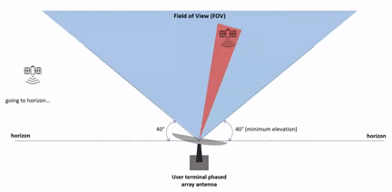

# បច្ចេកវិទ្យាផ្កាយរណបសំរាប់ជំនួយដល់វិស័យទូរគមនាគមន៍នៅកម្ពុជា
* កម្រងអត្ថបទបកស្រាយពី បច្ចេកវិទ្យាផ្កាយរណបសំរាប់ជំនួយដល់វិស័យទូរគមនាគមន៍នៅកម្ពុជា
* រៀបរៀងនិងប្រែសំរួលដោយ សាកល មរកត

## សេចក្តីផ្តើម
* សព្វថ្ងៃនេះ [ជាងមួយភាគបី](https://www.itu.int/itu-d/reports/statistics/facts-figures-2021/)នៃប្រជាជននៅក្នុងពិភពលោក មិនមានប្រព័ន្ធអ៊ីនធឺណិតប្រើប្រាស់ទេ 
* ផ្កាយរណបក្នុងគន្លងផែនដីទាប (LEO Sat) ត្រូវបានគេព្យាករណ័ថាជាបច្ចេកវិទ្យាសម្រាប់បដិវត្តអ៊ីនធឺណិត
* ផ្កាយរណបនឹងអាចជួយ
  * ភ្ជាប់ប្រព័ន្ធទូរគមនាគមន៍ទូទាំងពិភពលោក 
  * បំបាត់ការបែងចែកឌីជីថលរវាងទីក្រុង និងតំបន់ជនបទដាច់ស្រយាល

## GEO vs. LEO Satellite
* ចំនុចខុសគ្នារវាងផ្កាយរណបនៅគន្លងខ្ពស់ (GEO) និងគន្លងទាប (LEO)

* តារាងខាងក្រោមបង្ហាញពី ចំនុចខុសគ្នារវាងផ្កាយរណបនៅគន្លងខ្ពស់ (GEO) និងគន្លងទាប (LEO)

|           | Altitude | Orbital Period | Latency | Number of Satellites to Span Globe | Cost per Satellite ($) | Effective Lifetime of Satellite |
| --- | :---: | :---: | :---: | :---: | :---: | :---: |
| GEO | 35,786 km | 24 hours | ~477 ms | 3 | Approx. 100–400 million | 15–20 years |  
| LEO | 160–2,000 km | 88–127 min | ~2–27 ms | hundreds or thousands (depending on altitude) | Approx. 0.5–45 million | 5–10 years |

Source: International Telecommunication Union. 2020. [The Last-Mile Internet Connectivity Solutions Guide: Sustainable Connectivity Options for Unconnected Sites](https://www.itu.int/en/ITU-D/Technology/Documents/LMC/The%20Last-Mile%20Internet%20Connectivity%20Solutions%20Guide.pdf).

## Terrestrial vs. Satellite Internet
* កាលពីមុន ប្រព័ន្ធទូរគមនាគមន៍ដោយប្រើប្រាស់ផ្កាយរណប ត្រូវបានផ្តល់ជាចម្បងដោយបច្ចេកវិទ្យាផ្កាយរណបនៅGEO ប៉ុន្តែពេលនេះ ពិភពលោកកំពុងងាកទៅប្រើប្រាស់បច្ចេកវិទ្យផ្កាយរណបនៅLEOម្តង
* បើប្រៀបធៀបទៅនឹងផ្កាយរណបនៅGEO ផ្កាយរណបនៅLEO មានទីតាំងនៅជិតផែនដីប្រហែលជាង ៥០ ដង ហើយចំនុចពិសេសរបស់ប្រព័ន្ធអ៊ីនធឺណិតដោយផ្កាយរណបនៅLEO មានដូចជា
  * ផ្តល់នូវភាពរអាល់រអួលទាប (តិចជាង 30ms) / low latency
  * ផ្តល់កម្រិតបញ្ជូនខ្ពស់ (ប្រហែល 100Mbps) / high throughput
  * ផ្តល់សេវាគ្របដណ្តប់ជំវិញពិភពលោក / global coverage
* តារាងខាងក្រោមបង្ហាញពី ចំនុចខុសគ្នារវាងប្រព័ន្ធអ៊ីនធឺណិតលើដី និងផ្កាយរណប

## Emerging LEO Satellite Constellations
* សព្វថ្ងៃនេះ មានគម្រងប្រព័ន្ធផ្កាយរណបនៅLEOចំនួនបួនធំៗ
  * Starlink
  * OneWeb
  * Telesat
  * Project Kuiper
* បើប្រៀបធៀបគម្រោងទាំងបួនខាងលើ Starlink គឺនាំមុខគូប្រជែងរបស់ខ្លួន ចំពោះចំនួនផ្កាយរណបនៅលើគន្លង និងសេវាកម្ម
* តារាងខាងក្រោមបង្ហាញពី ចំនុចខុសគ្នារវាងប្រព័ន្ធផ្កាយរណបនីមួយៗ

|           | Starlink | OneWeb | Telesat | Project Kuiper |
| --- | :---: | :---: | :---: | :---: |
| Constellation Size | 4,409 | 588 | 298 | 3,236 |
| Frequency Band | Ka gateway, Ku users | Ka gateway, Ku users| Ka | Ka |
| Orbit | 550 km | 1,200 km | 1000 km | 600 km |
| Capacity | ~75 Tbps | ~5 Tbps | ~12 Tbps | ~30-32 Tbps |
| Target Markets | Residential broadband, government | Wholesale, B2B, backhaul, enterprise, government, mobility | Backhaul, mobility, enterprise, government | Residential broadband, enterprise, backhual, mobility |
| Status (June, 2022) | Partially operational | Testing | In development | In development |

## មើលគន្លងផ្កាយរណបតាមវេបសាយLeoLabs
* LeoLabs (Low-Earth orbit Labs) គឺជាក្រុមហ៊ុនដែលផ្តល់សេវាកម្មតាមដាន គន្លងផ្កាយរណប (satellites' orbit) និងកំទេចកំទីអវកាស (space debris) ដែលអាចបង្កគ្រោះថ្នាក់ដល់ផ្កាយរណប
* សូមចុចតំណភ្ជាប់ខាងក្រោមដើម្បីមើលគន្លងរបស់ផ្កាយរណបផ្សេងៗ
  * [Starlink](https://platform.leolabs.space/visualizations/leo#search=starlink;view=objectType)
  * [OneWeb](https://platform.leolabs.space/visualizations/leo#search=oneweb;view=objectType)

## Example: Starlink

## FAQ (កំពុងរៀបចំ)

## មាតិកាអត្ថបទ
* ផ្កាយរណប Starlink និងដំនើរការរបស់វា (កំពុងរៀបចំ)
* ផ្កាយរណប OneWeb និងដំនើរការរបស់វា (កំពុងរៀបចំ)
